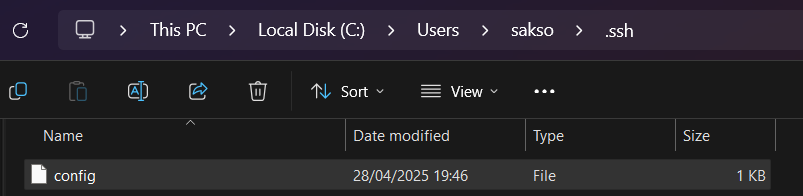
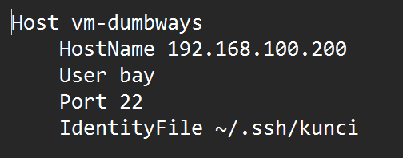
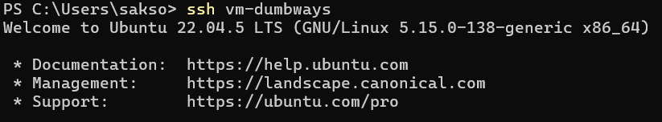
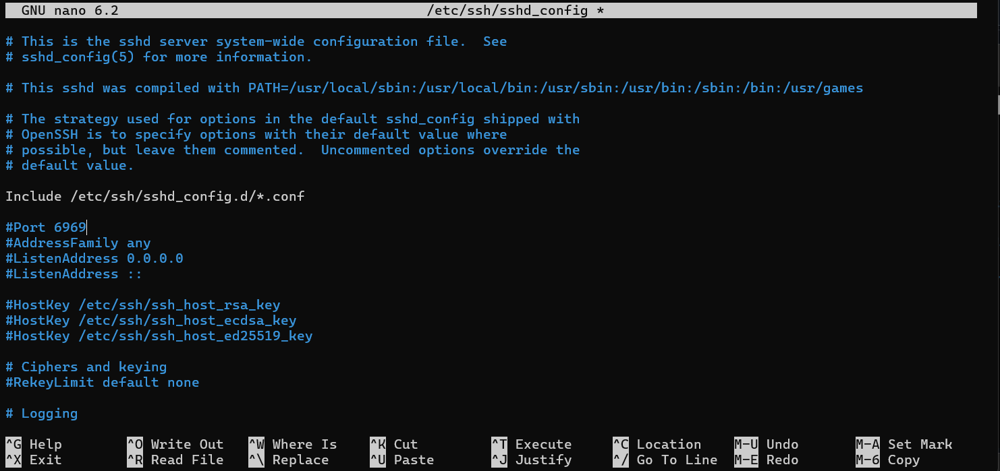
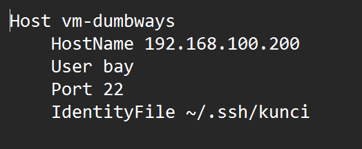
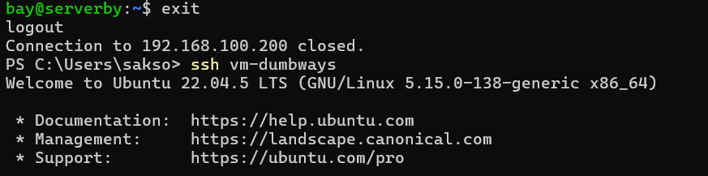
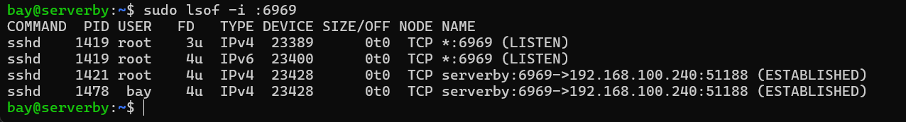

# 1. Bisa ssh kedalam server dengan contoh command : 
`ssh vm-dumbways`
* masuk ke direktori windows dengan format berikut C:\Users\sakso dan buat file config



* edit dengan notepad file config dengan settingan seperti ini
```bash
Host vm-dumbways
    HostName 192.168.100.200
    User bay
    Port 22
    IdentityFile ~/.ssh/kunci
```



* login di terminal dengan perintah vm-dumbways
```bash
ssh vm-dumbways
```




# 2. Rubah port SSH menjadi 6969
* masuk ke config sshd_config dengan nano

``` bash
sudo nano /etc/ssh/sshd_config
```


* ganti port 22 menjadi 6969 dan hilangkan simbol hash atau #
* 


* ganti juga port yang ada di dalam direktori windows
* 


* setelah itu update systemctl di terminal
  
``` bash
sudo systemctl restart ssh
```


* exit dan login kembali
  
``` bash
exit
```

``` bash
ssh vm-dumbways
```



* check koneksi menggunakan lsof
  
``` bash
sudo lsof -i :6969
```



# 3. SSH hanya bisa diakses 1 device (jika login dari device lain akan bentrok)
* login ke server

* masuk ke direktori dan edit konfigurasi
``` bash
sudo nano /etc/security/limits.conf
```
``` bash
bay maxlogins 1
```


* restart ssh dan coba login lagi
``` bash
sudo systemctl restart ssh
```


