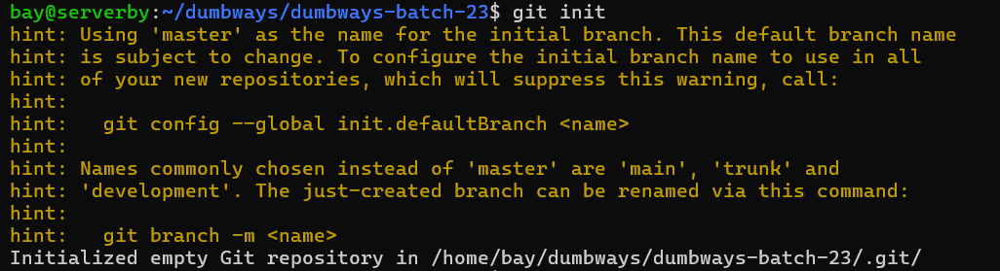

# Task Version Control System
**1. Penjelasan tentang git**

>: Git adalah tools yang membantu developer untuk menyimpan berbagai versi dari coding projects dan kolaborasi dengan lainnya tanpa membuat bingung atau kehilangan progres. Git sama halnya fitur "save game" yang dapat menyimpan progres checkpoint video game, dan selalu bisa mundur atau kembali apabila ada yang salah.

**2. Buat sebuah repository bernama "dumbways-batch-23" yang berisi 3 file**
* login dengan username dan email github di terminal
```bash
git config --global user.name <name>
git config --global user.email <mail>
git config --list
```


* membuat key ssh untuk menyambungkan terminal dengan github
```bash
ssh-keygen
```


* copy ssh publik ke github untuk authentikasi ssh
```bash
cat id_rsa.pub
```


* ini adalah tampilan saat berhasil melakukan authentikasi ssh
```bash
ssh git@github.com -T
```


* kemudian menginstal github cli untuk bisa membuat repositori
```bash
sudo apt install gh
```


* kemudian menginstal github cli untuk bisa membuat repositori
```bash
sudo apt install gh
```


* lakukan perintah untuk auth login dengan otp dari github
```bash
gh auth login
```


* membuat repositori denngan perintah berikut
```bash
gh repo create --public --source=. --push
```


* push repositori yang sudah dibuat
```bash
git push -u origin master
```


* membuat file textsatu, textdua, dan texttiga dengan perintah cat
```bash
cat > textsatu
wawawiwawawi
^C
cat > textdua
wawawiwawawa
^C
cat textsatu textdua > texttiga
```


* melakukan perintah git init untuk inisiasi branch
```bash
git init
```


* melakukan perintah git add . untuk meregister file ke dalam repositori dan git status untuk mengecek apakah file sudah teregister 
```bash
git add .
git status
```


* melakukan perintah commit untuk menyimpan perubahan dan comment sebelum di push ke github
```bash
git commit -m "satu commit"
```


* melakukan perintah untuk membuat repositori dan juga push ke github
```bash
gh repo create --public --source=. --push
```


**3. Manage repository tugas kalian (devops23-dumbways-<nama>) menggunakan terminal!**
* 
```bash

```

