# 1. Repository dumbways-batch-23 dibuat private

* di halaman repositori saksono/dumbways-batch-23 pilih settings
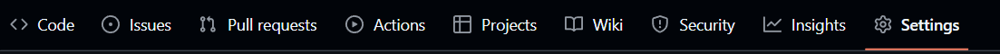
  
* scroll paling bawah sampe ketemu danger zone kemudian pilih change visibility
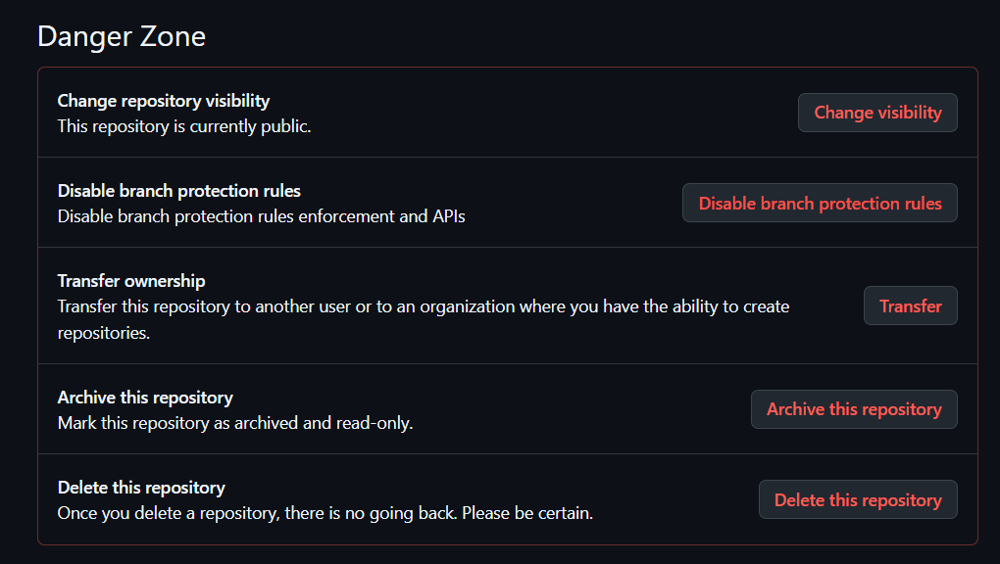

* di dalam change visibility pilih change to private
  
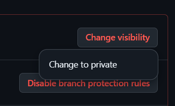
  
* akan muncul popup seperti ini terus lanjutkan
  
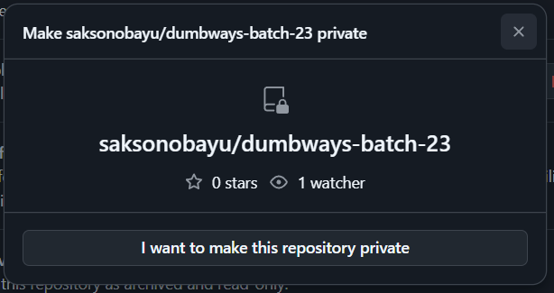

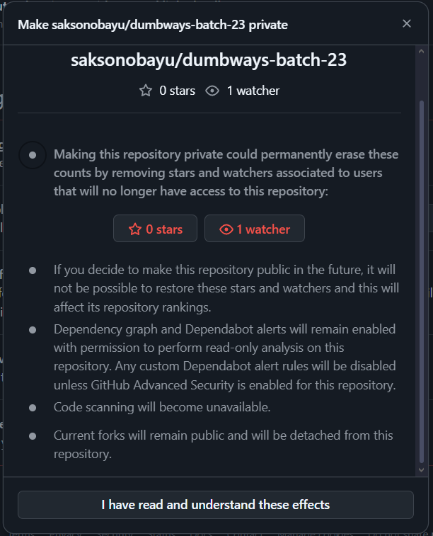

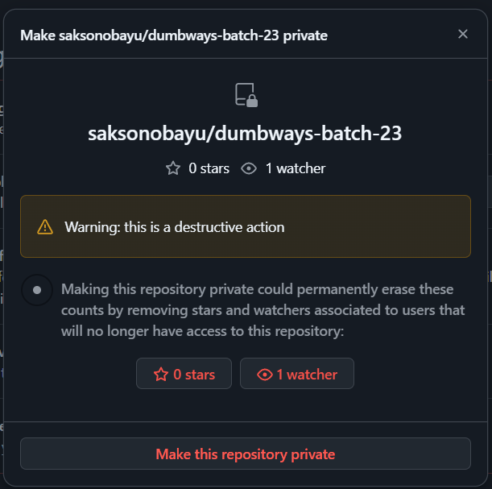

# 2. Demokan penggunaan Pull Request
* clone repositori
```bash
git clone git@github.com:saksonobayu/dumbways-batch-23.git
```
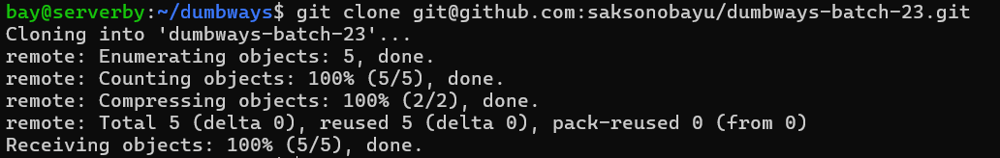

* buat branch baru
```bash
git checkout -b main
```
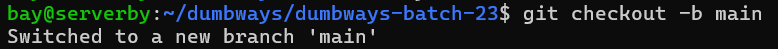

* buat file di dalam branch baru
```bash
cat > kodenuklir.txt
```
```bash
snis41
```
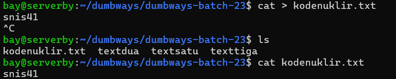

* register file sebelum di commit
```bash
git add kodenuklir.txt
```
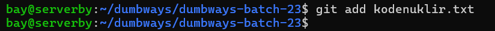

* commit file dengan deskripsi "commit di branch main"
```bash
git commit -m "commit di branch main"
```
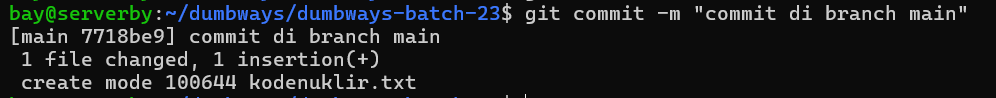

* push file ke branch baru
```bash
git push -u origin main
```
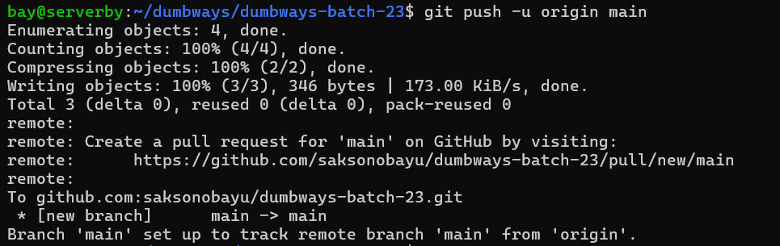

* pull repositori dengan versi terakhir
```bash
git pull origin main
```
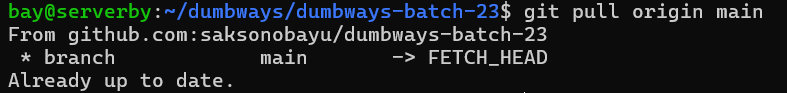

* mengambil semua folder dan file
```bash
git fetch --all
```
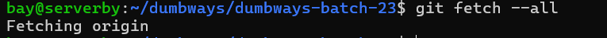

* menampilkan semua branch
```bash
git branch -a
```
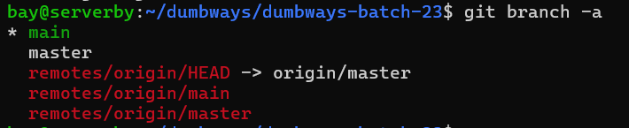

