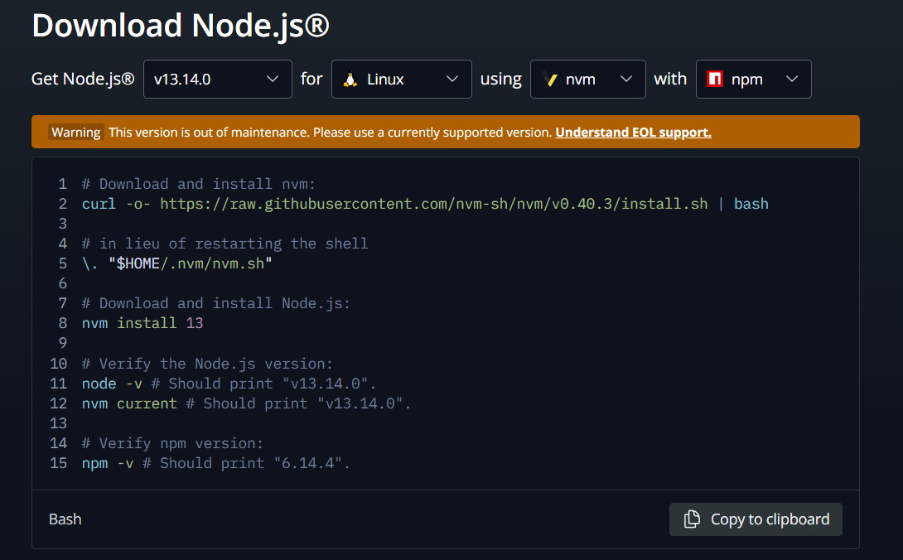
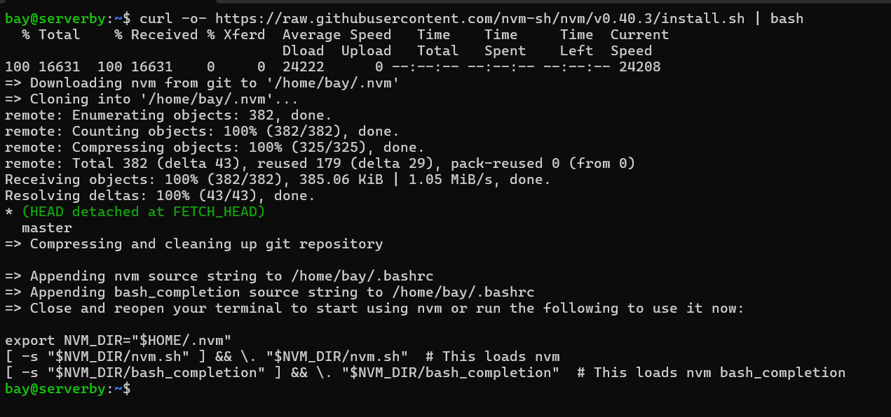
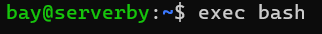
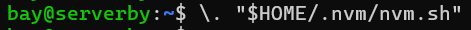
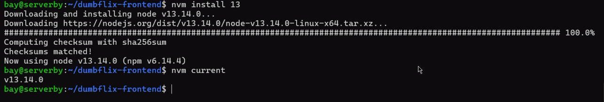
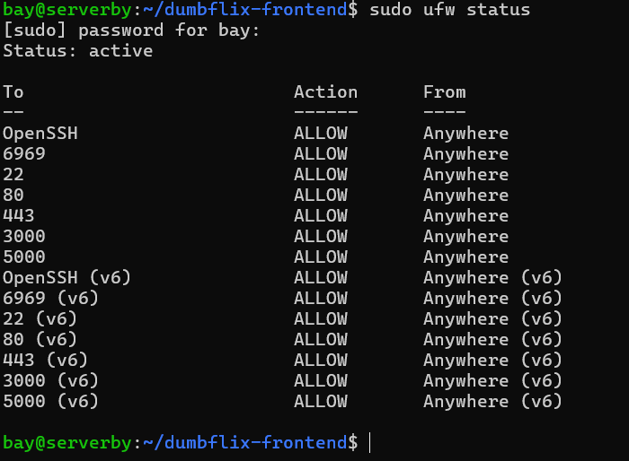
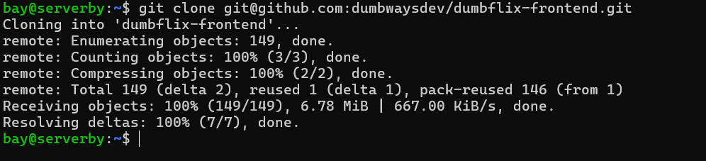
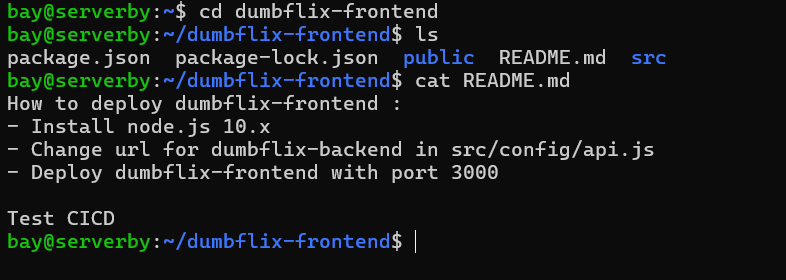
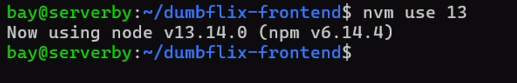
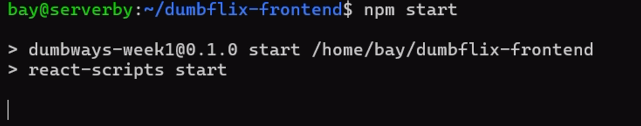

# NodeJS
- Deploy app wayshub-frontend
- Berjalan di port 3000
- Menggunakan NodeJS 13

**1. Instalasi node js di official website https://nodejs.org/en/download**
> ganti kebutuhan versi dengan versi 13, untuk linux, menggunakan nvm, dengan npm



**2. Melakukan instalasi sesuai petunjuk yang ada di atas**
```bash
curl -o- https://raw.githubusercontent.com/nvm-sh/nvm/v0.40.3/install.sh | bash
```



**3. Melakukan perintah exec bash agar sistem mendeteksi perintah node js atau update path**
```bash
exec bash
```



**4. Melakukan restart shell**
```bash
\. "$HOME/.nvm/nvm.sh"
```



**5. Melakukan instalasi node js versi 13**
```bash
nvm install 13
```



**6. Memberi akses ke port 3000**
```bash
sudo ufw allow 3000
```
```bash
sudo ufw status
```



**7. Melakukan git clone dumbflix-frontend**
```bash
git clone git@github.com:dumbwaysdev/dumbflix-frontend.git 
```



**8. Melakukan git clone dumbflix-frontend**
```bash
git clone git@github.com:dumbwaysdev/dumbflix-frontend.git 
```


**9. Masuk ke direktori dumbflix-frontend**
```bash
cd dumbflix-frontend
```



**10. Menggunakan npm versi 13**
```bash
nvm use 13
```



**11. Melakukan perintah npm start untuk deploy lokal project dumbflix-frontend**
```bash
npm start
```




**12. Buka browser dan akses ip address dengan port 3000**
```bash
192.168.100.200:3000
```


# Python
- Deploy app menampilkan text nama kalian!
- Berjalan di port 5000 & bisa dibuka melalui web

**1. loren ipsum**
```bash
loren ipsum
```


# Golang
- Deploy app menampilkan text "Golang geming!"

**1. loren ipsum**
```bash
loren ipsum
```

