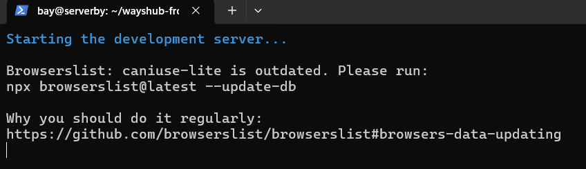

# NodeJS
- Deploy app wayshub-frontend
- Berjalan di port 3000
- Menggunakan NodeJS 13

**1. Instalasi node js di official website https://nodejs.org/en/download**
> ganti kebutuhan versi dengan versi 13, untuk linux, menggunakan nvm, dengan npm


**2. Melakukan instalasi sesuai petunjuk yang ada di atas**
```bash
curl -o- https://raw.githubusercontent.com/nvm-sh/nvm/v0.40.3/install.sh | bash
```


**3. Melakukan perintah exec bash agar sistem mendeteksi perintah node js atau update path**
```bash
exec bash
```


**4. Melakukan restart shell**
```bash
\. "$HOME/.nvm/nvm.sh"
```


**5. Melakukan instalasi node js versi 13**
```bash
nvm install 13
```


**6. Memberi akses ke port 3000**
```bash
sudo ufw allow 3000
```
```bash
sudo ufw status
```


**7. Melakukan git clone wayshub-frontend**
```bash
git clone git@github.com:dumbwaysdev/wayshub-frontend.git
```


**8. Masuk ke direktori wayshub-frontend**
```bash
cd wayshub-frontend
```


**9. Menggunakan npm versi 13**
```bash
nvm use 13
```


**10. Melakukan perintah npm start untuk deploy project wayshub-frontend**
```bash
npm start
```


* nah disitu terdapat error karena dependency nya belum ada, maka install dengan npm install

```bash
npm install
```

**11. Buka browser dan akses ip address dengan port 3000**
```bash
192.168.100.200:3000
```




# Python
- Deploy app menampilkan text nama kalian!
- Berjalan di port 5000 & bisa dibuka melalui web

**1. Melakukan instalasi pip yaitu package untuk python**
```bash
sudo apt install python3-pip
```


**2. Membuat direktori python biar rapi gitu aja**
```bash
mkdir python
```


**3. Instalasi library flask**
```bash
pip install flask
```


**4. Membuat file index.py di dalam direktori python dan copy snippet code berikut**
```bash
cat > index.py
from flask import Flask

app = Flask(__name__)

@app.route('/')
def index():
    return 'SAKSONO BAYU AJIE SUMANTRI!'

app.run(host='0.0.0.0', port=5000)
```


**5. Memberi akses port 5000**
```bash
sudo ufw allow 5000
sudo ufw status
```


**6. Eksekusi python dengan python3 index.py kemudian copy address ke web**
```bash
python3 index.py
```


# Golang
- Deploy app menampilkan text "Golang geming!"

**1. Instalasi version golang dari official website https://go.dev/dl/**
```bash
wget https://go.dev/dl/go1.24.2.linux-amd64.tar.gz
```


**2. Menjadi super user untuk install golang https://go.dev/doc/install**
```bash
sudo su
rm -rf /usr/local/go && tar -C /usr/local -xzf go1.24.2.linux-amd64.tar.gz
```


**3. Export golang ke path environment**
```bash
export PATH=$PATH:/usr/local/go/bin
```


**4. Mengecek versi**
```bash
go version
```


**5. Membuat direktori golang biar rapi dan buat file index.go**
```bash
mkdir golang
cd golang
nano index.go
```


* nah kemudian copy snipet code ke dalam file index.go
```bash
package main

import (
	"fmt"
	"net/http"
)

func handler(w http.ResponseWriter, r *http.Request) {
	fmt.Fprintf(w, "<h1>Golang Geming</h1>")
}

func main() {
	http.HandleFunc("/", handler)
	fmt.Println("Server running on http://192.168.1.1:8080...")
	http.ListenAndServe("192.168.100.200:8080", nil)
}
```


**6. Jangan lupa kasih akses ke port 8080**
```bash
sudo ufw allow 8080
```


**7. Eksekusi golang dengan perintah berikut**
```bash
go run index.go
```


**8. Buka browser dan akses ip addressnya**
```bash
192.168.100.200:8080
```


