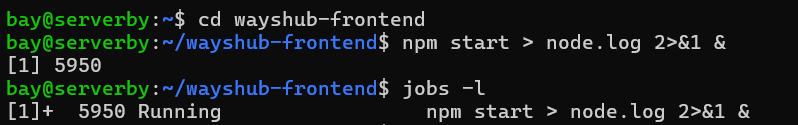
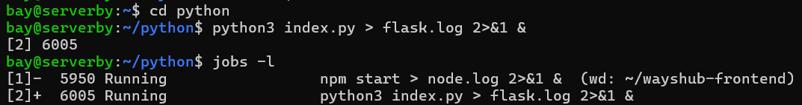
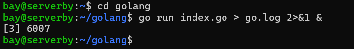

# NodeJS + Python: Jalan di Background (Bisa Ngegas Terminal Lagi)
**1. Jalankan NodeJS (Aplikasi Wayshub)**
```bash
cd wayshub-frontend
npm start > node.log 2>&1 &
```


* .> = Semua output disimpen di file node.log
* & = Aplikasi jalan di belakang layar, terminal bebas dipake!
* Cek jalan/tidak: jobs -l (kalo muncul angka, berarti oke)
  
**2. Jalankan Python (Aplikasi Flask)**
```bash
cd python
python3 index.py > flask.log 2>&1 &
```



# Golang: Bisa Dibuka di Browser
**1. Jalankan Golang**
```bash
cd golang
go run index.go > go.log 2>&1 &
```




**Tips kalo mau tutup terminal tapi aplikasi tetep jalan:**
```bash
nohup npm start &  # Untuk NodeJS
nohup python3 index.py &  # Untuk Python
nohup go run index.go &  # Untuk Golang
```

**Cek log kalo error:**
```bash
Cek log klo error
cat node.log  # Log NodeJS
cat flask.log  # Log Python
cat go.log    # Log Golang
```
