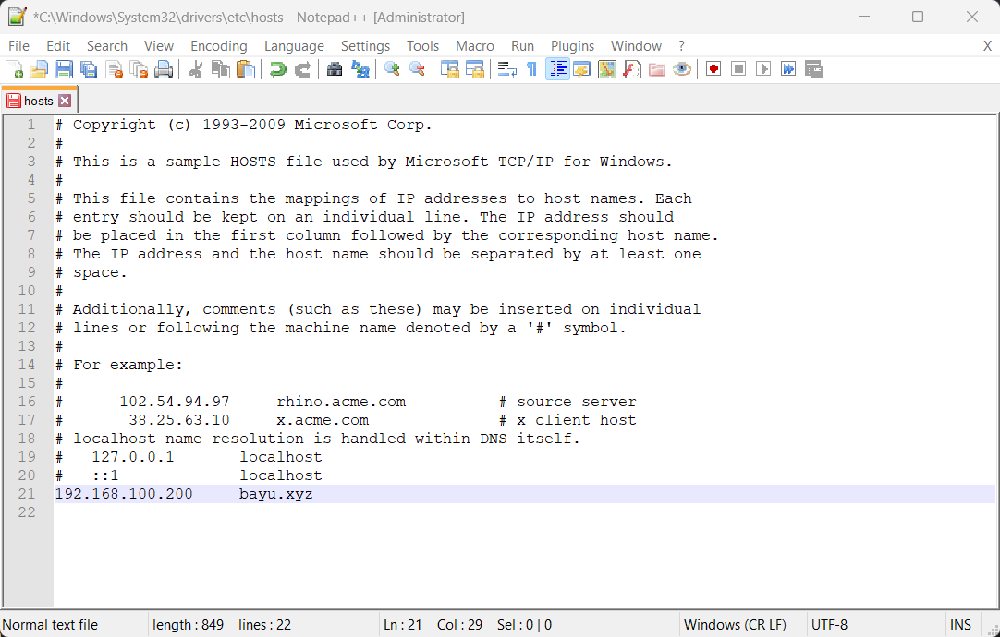
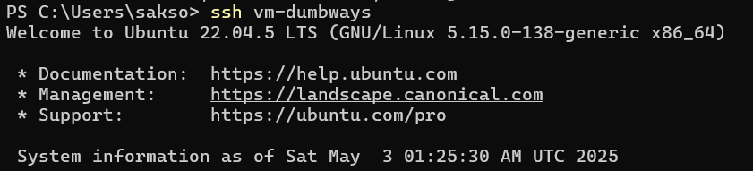
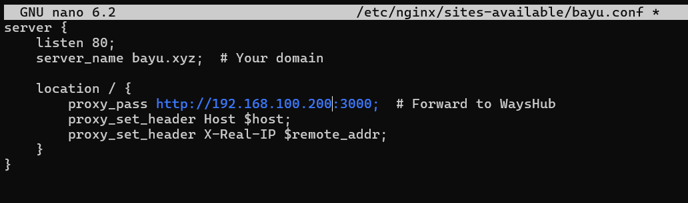
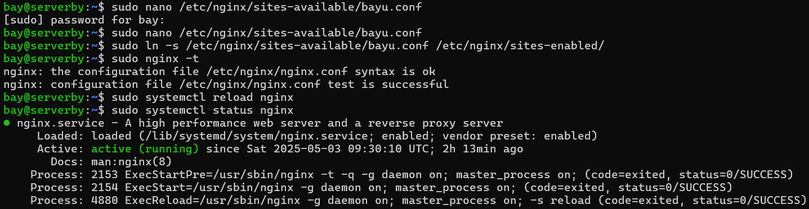
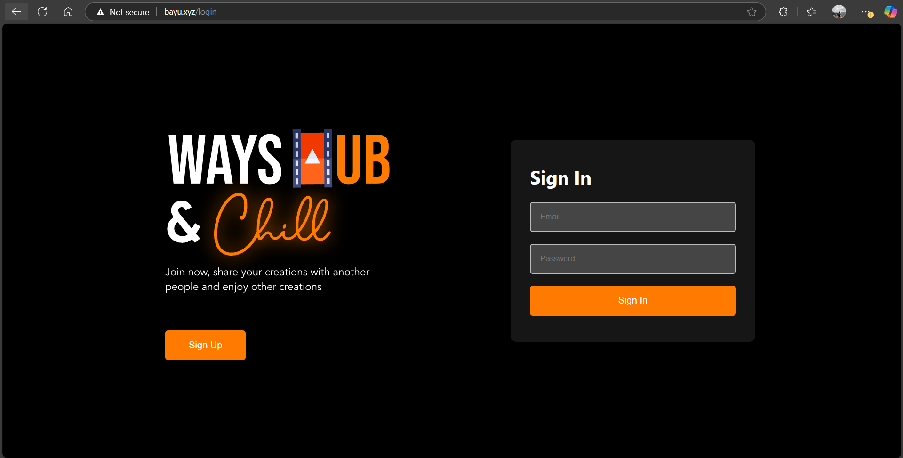

# 1. Gambarkan struktur web server menggunakan reverse proxy dan jelaskan cara kerjanya!


Client Request: 
- buka bayu.xyz di browser.

Reverse Proxy (Nginx):
- Dapat request dari client.
- Jadi "perantara" yang nentuin backend server mana (contoh: WaysHub) yang harus nanganin request.
- Terus ngirim request itu ke backend server (misalnya localhost:3000).

Backend Server:
- Ngolah request (contoh: ambil data dari database).
- Kirim balik respons ke reverse proxy.

Reverse Proxy: 
- Ngasih respons tadi balik ke client.

Manfaatnya:
- Security: Nge-hide identitas backend server biar gak ketahuan.
- SSL Handling: Ngurus enkripsi/dekripsi HTTPS biar aman.
- Caching: Nyimpen file static (kaya gambar) biar kalo dibuka lagi lebih cepet.

# 2. Buatlah Reverse Proxy untuk aplilkasi yang sudah kalian deploy kemarin. (wayshub), untuk domain nya sesuaikan nama masing" ex: alvin.xyz.

- Buka direktori windows
```bash
C:\Windows\System32\drivers\etc
```

- Edit hosts dengan notepad++ sebagai admin
```bash
192.168.100.200 bayu.xyz
```


- Ke terminal login server dan run wayshub-frontend
```bash
ssh vm-dumbways
```


- Buat file untuk konfigurasi di sites-available
```bash
sudo nano /etc/nginx/sites-available/bayu.conf
```
```bash
    server {
        listen 80;
        server_name bayu.xyz;  # Your domain
    
        location / {
            proxy_pass http://192.168.100.200:3000;  # Forward to WaysHub
            proxy_set_header Host $host;
            proxy_set_header X-Real-IP $remote_addr;
        }
    }
```
    

    

- Buat symbolic link ke sites-enabled
```bash
`sudo ln -s /etc/nginx/sites-available/bayu.conf /etc/nginx/sites-enabled/`
```
```bash
sudo nginx -t
```
```bash
sudo systemctl restart nginx
```


- Buka browser dan akses dengan bayu.xyz


